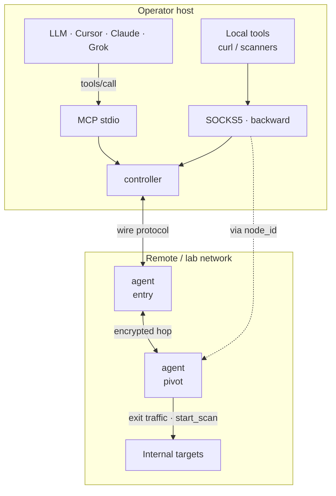
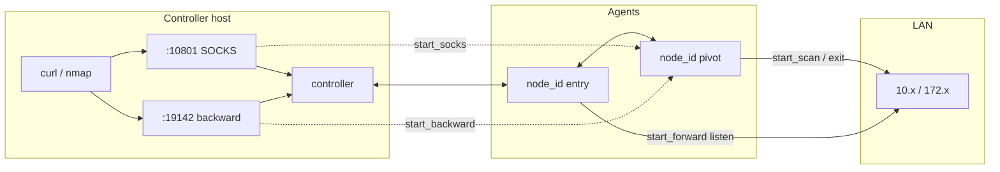
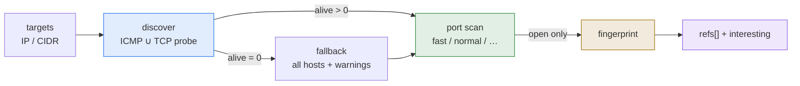
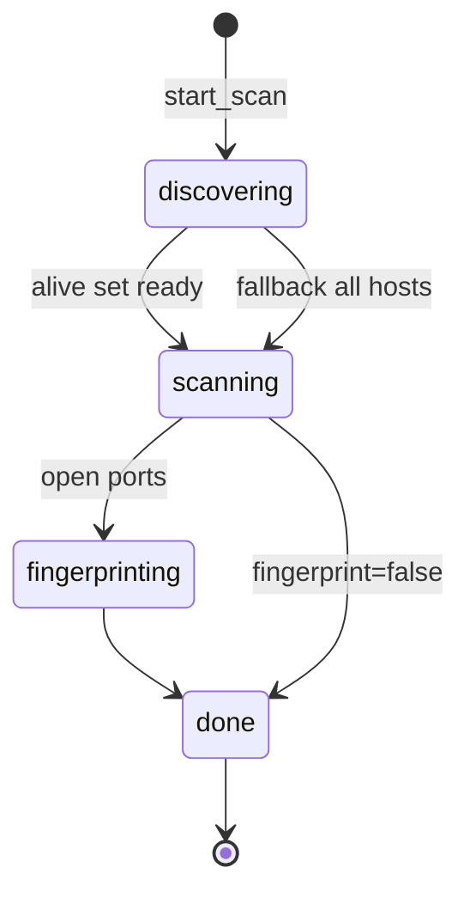

# styx-mcp

[](LICENSE)
[](https://go.dev/)
[](https://modelcontextprotocol.io/)
[](https://github.com/N0va-7/styx-mcp/stargazers)

**English** | [简体中文](README_ZH.md)

> Multi-hop proxy **controlled by MCP tools** — give Cursor / Claude / Grok an AI-native jump network without a separate admin TUI.



## Disclaimer

> **Authorized use only.** Use only on systems you own or have explicit written permission to test (labs, CTF / exam ranges, RoE-covered engagements). Unauthorized use is illegal. You are solely responsible for how you use this software.

**Please read this README (especially [SOCKS vs forward vs backward vs scan](#socks-vs-forward-vs-backward-vs-scan)) before use.**

## Why styx-mcp?

| | [Stowaway](https://github.com/ph4ntonn/Stowaway) | **styx-mcp** |
| :--- | :--- | :--- |
| Control plane | Interactive admin TUI | **MCP tools** (LLM / Cursor native) |
| SOCKS listen | Admin side | **Controller** (same idea) |
| Primary user | Human operator | Agent + human |
| Remote shell / download | Yes | Not yet |

Built for **agent-driven** ops (MCP-native control plane). Multi-hop topology draws inspiration from [Stowaway](https://github.com/ph4ntonn/Stowaway); the identity, crypto, and tool surface are styx-mcp’s own.

## Features

- Tree topology: active (`-c`) / passive (`-l`), multi-hop pivots
- Mutual **HMAC** preauth + optional **TLS** (raw TCP only; WebSocket not implemented)
- **SOCKS5** on the controller — local tools exit via a chosen node
- Per-stream **byte-window flow control** (no silent SOCKS drops; matching controller/agent required)
- **Forward** (listen on agent) & **backward** (listen on controller)
- **Async `start_cmd`** (non-interactive `sh -c`, returns `task_id`)
- **Async `start_scan`** — intranet recon from a chosen agent (discover → port scan → light fingerprint + vuln **refs**, not exploits)
- **Async `pull_file`** / `upload_file` (task + local path; not interactive shell)
- Async tasks + `get_task_status` (phases + progressive `result.progress` for long scans)
- Cross-compile: Linux / Windows / macOS (`make build-all`)

<details>
<summary><strong>Not included yet</strong></summary>

- Interactive remote shell
- SOCKS username/password
- Interactive admin TUI (by design: MCP is the control plane)
- Full fscan-style brute force / POC execution

</details>

## Table of contents

- [Quick start](#quick-start)
- [Cursor MCP setup](#cursor-mcp-setup)
- [MCP tools](#mcp-tools)
- [Intranet scan (`start_scan`)](#intranet-scan-start_scan)
- [Examples](#examples)
- [CLI flags](#cli-flags)
- [Security notes](#security-notes)
- [Project layout](#project-layout)
- [Acknowledgments](#acknowledgments)
- [License](#license)

## Quick start

```bash
git clone https://github.com/N0va-7/styx-mcp.git
cd styx-mcp
make build          # → release/<os>-<arch>/
```

```bash
# Terminal A — controller (keeps stdio for MCP; for CLI smoke only)
./release/$(uname -s | tr A-Z a-z)-$(uname -m | sed 's/x86_64/amd64/;s/aarch64/arm64/')/controller \
  -s change-me -l 127.0.0.1:19137

# Terminal B — agent
./release/.../agent -s change-me -c 127.0.0.1:19137
```

Prefer **Cursor**? Skip terminal A and use the [wrapper](#cursor-mcp-setup) below, then only start the agent.

```bash
make build-all   # linux-amd64 / windows-amd64 / darwin-arm64
make test
```

## Cursor MCP setup

1. `make build` so `release/<os>-<arch>/controller` exists.
2. `~/.cursor/mcp.json` (or project `.cursor/mcp.json`):

```json
{
  "mcpServers": {
    "styx-mcp": {
      "command": "/absolute/path/to/styx-mcp/scripts/styx-mcp-wrapper.sh",
      "env": {
        "STYX_SECRET": "change-me-to-a-strong-secret",
        "STYX_LISTEN": "127.0.0.1:19137",
        "STYX_LOG": "/tmp/styx-mcp-controller.log"
      }
    }
  }
}
```

3. Cursor → **Settings → MCP** → enable / refresh **styx-mcp**.
4. On the foothold:

```bash
./agent -s change-me -c <controller-ip>:19137
```

| Env | Default | Meaning |
| :--- | :--- | :--- |
| `STYX_SECRET` | *(required)* | Shared secret (`-s`) |
| `STYX_LISTEN` | `127.0.0.1:19137` | Agent listen addr on controller |
| `STYX_LOG` | `/tmp/styx-mcp-controller.log` | Controller log |
| `STYX_MCP_LOG` | *(unset)* | Optional raw MCP stdio log path |
| `STYX_BIN_DIR` | `release/<os>-<arch>` | Binary directory override |

Never commit real secrets into public configs.

## MCP tools

| Tool | What it does | Listen / act where |
| :--- | :--- | :--- |
| `list_nodes` | Topology | — |
| `get_node_detail` | Detail | — |
| `add_node_memo` / `delete_node_memo` | Memos | — |
| `start_listener` | Wait for child agents | **Agent** |
| `connect_node` | Dial a child | **Agent** |
| `start_socks` | SOCKS5 for local tools | **Controller** → exit via node |
| `start_forward` | Port forward | **Agent** listen → target |
| `start_backward` | Reverse forward | **Controller** → via node → target |
| `upload_file` | Upload | Controller → agent |
| `pull_file` | Pull file to controller | Agent → controller path |
| `start_cmd` | Non-interactive one-shot | Agent `sh -c` (async `task_id`) |
| `start_scan` | Intranet port scan + light fingerprint | **Agent** network stack (async `task_id`) |
| `get_task_status` | Poll async work | — |
| `shutdown_node` | Kill node | — |

Long-running calls return `task_id` → poll with `get_task_status`.

### SOCKS vs forward vs backward vs scan

| You want… | Use |
| :--- | :--- |
| `curl` / scanners on the **controller host** into an internal net | `start_socks` |
| One **controller** port → one internal `ip:port` | `start_backward` |
| A port **on the foothold** that dials elsewhere | `start_forward` |
| Structured open ports / fingerprints **from the agent** (no local SOCKS needed) | `start_scan` |

`start_forward` is **not** a drop-in for local SOCKS. `start_scan` is not a full fscan clone (no brute/exploit).



## Intranet scan (`start_scan`)

Runs on the selected **agent** (traffic exits that host).



**Discover (hybrid, default on):** host is alive if **ICMP succeeds OR** any TCP probe port is open.  
If zero hosts are alive, the job **falls back** to scanning all targets and sets `warnings` (avoids a silent empty result).

**Port method:** `auto` (default) uses **SYN** when the agent has raw IPv4 TCP (root / CAP_NET_RAW on Linux), otherwise **TCP connect**. Force with `method=connect` or `method=syn`.

| Arg | Default | Notes |
| :--- | :--- | :--- |
| `node_id` | required | Exit via this agent |
| `targets` | required | IPv4 IP / CIDR / comma list |
| `mode` | `fast` | `fast` \| `normal` \| `full` \| `custom` (`full` is expensive) |
| `ports` | — | Required for `custom` (`22,80,8000-8100`) |
| `fingerprint` | `true` | Fingerprint open ports only |
| `discover` | `true` | Hybrid alive probe first |
| `method` | `auto` | `auto` \| `connect` \| `syn` |
| `concurrency` | `200` | Max 500 |
| `timeout_ms` | `500` | Per-probe timeout |

**Phases** (via `get_task_status`):



While discovering, `result.progress` may include `stage`, `icmp_done` / `icmp_total`, `icmp_alive`, `alive_n`, `tcp_probes`.

**Rebuild note:** controller and agent must be built from the **same commit** after protocol changes (SCAN\*).

Lab helper (authorized ranges only; uses port **19139** so it does not steal MCP’s `:19137`):

```bash
STYX_SECRET=… STYX_CALLBACK=<attacker-ip> ./scripts/lab-scan-e2e.sh
```

## Examples

<details open>
<summary><strong>SOCKS5</strong></summary>

```json
{ "name": "start_socks", "arguments": { "node_id": 0, "address": "127.0.0.1:10801" } }
```

```bash
curl --socks5-hostname 127.0.0.1:10801 http://<internal-host>/
export ALL_PROXY=socks5h://127.0.0.1:10801
```

</details>

<details>
<summary><strong>Two-level topology</strong></summary>

```bash
./agent -s change-me -l 127.0.0.1:19138   # child, passive
```

```json
{ "name": "connect_node", "arguments": { "node_id": 0, "address": "127.0.0.1:19138" } }
```

</details>

<details>
<summary><strong>Forward / backward / upload</strong></summary>

```json
{
  "name": "start_forward",
  "arguments": {
    "node_id": 0,
    "listen_address": "127.0.0.1:19141",
    "target_address": "10.0.0.5:80"
  }
}
```

Connect to `listen_address` **on the agent host**.

```json
{
  "name": "start_backward",
  "arguments": {
    "node_id": 0,
    "local_address": "127.0.0.1:19142",
    "target_address": "10.0.0.5:80"
  }
}
```

Connect to `127.0.0.1:19142` **on the controller host**.

```json
{
  "name": "upload_file",
  "arguments": {
    "node_id": 0,
    "local_path": "/path/to/tool",
    "remote_path": "/tmp/tool"
  }
}
```

</details>

<details>
<summary><strong>Intranet scan</strong></summary>

```json
{
  "name": "start_scan",
  "arguments": {
    "node_id": 0,
    "targets": "172.16.23.0/24",
    "mode": "fast",
    "discover": true,
    "method": "auto",
    "fingerprint": true
  }
}
```

```json
{ "name": "get_task_status", "arguments": { "task_id": "start_scan-1" } }
```

Useful result fields: `stats` (`hosts_alive`, `discover_ms`, `method`, `fallback`, …), `open[]`, `summary.interesting[]`, optional `warnings[]`.  
`refs` are **hints** (CVE/advisory links), not confirmed vulnerabilities.

</details>

## CLI flags

<details>
<summary><strong>controller</strong></summary>

| Flag | Description |
| :--- | :--- |
| `-s` | Shared secret |
| `-l` | Listen for agents `[ip]:port` |
| `-c` | Optional active connect |
| `-down` | `raw` only (`ws` rejected) |
| `-tls-enable` | TLS on node links |
| `-domain` | TLS SNI / WS domain |
| `-heartbeat` | Heartbeat to first node |

</details>

<details>
<summary><strong>agent</strong></summary>

| Flag | Description |
| :--- | :--- |
| `-s` | Shared secret |
| `-c` | Connect to parent / controller |
| `-l` | Passive listen |
| `-up` / `-down` | `raw` only (`ws` rejected) |
| `-tls-enable` / `-domain` | TLS |
| `-reconnect` | Seconds (`0` = off) |
| `-socks5-proxy` / `-socks5-proxyu` / `-socks5-proxyp` | Reach parent via SOCKS5 |
| `-http-proxy` | Reach parent via HTTP proxy |

</details>

Controller and agents must share the **same secret** (and matching TLS/WS options).

## Security notes

- Treat `-s` / `STYX_SECRET` like a password; rotate after shared labs. The wrapper **requires** `STYX_SECRET` (no weak default).
- Payload encryption uses **HKDF-SHA256** derived AES-256-GCM keys (controller and agents must run matching versions).
- Optional TLS (`-tls-enable`) derives a stable cert from the shared secret and verifies peers (still use a strong secret).
- Default wrapper listen is `127.0.0.1:19137`; set `STYX_LISTEN=0.0.0.0:…` only for remote agents.
- Bind SOCKS to `127.0.0.1` unless you intentionally expose it.
- Upload paths allow absolute destinations but reject `..`; max single-file transfer is 32 MiB.
- MCP stdio logging is **off** by default; set `STYX_MCP_LOG=/path` only when debugging (may contain secrets).
- `start_scan` is recon-only (connect/SYN + light fingerprint + advisory links). Do not treat refs as confirmed vulns. Rebuild controller **and** agent together after SCAN\* protocol changes.

## Project layout

```text
cmd/controller/     controller + MCP entrypoint
cmd/agent/          agent entrypoint
scripts/            MCP wrapper, lab-scan-e2e.sh, lab_scan_smoke.go
pkg/controller/     control plane, SOCKS / backward / scan tasks
pkg/mcp/            MCP tools
pkg/node/           agent handlers (incl. scan job)
pkg/scan/           targets, discover, connect/SYN port check
pkg/fingerprint/    light fingerprint + vuln ref table
pkg/protocol/       wire protocol
pkg/share/preauth/  HMAC mutual preauth
```

## Acknowledgments

Multi-hop jump-proxy ideas are inspired by [Stowaway](https://github.com/ph4ntonn/Stowaway) (MIT, © ph4ntom) — thank you.  
MCP server stack uses [mcp-go](https://github.com/mark3labs/mcp-go).

## License

[MIT](LICENSE)
